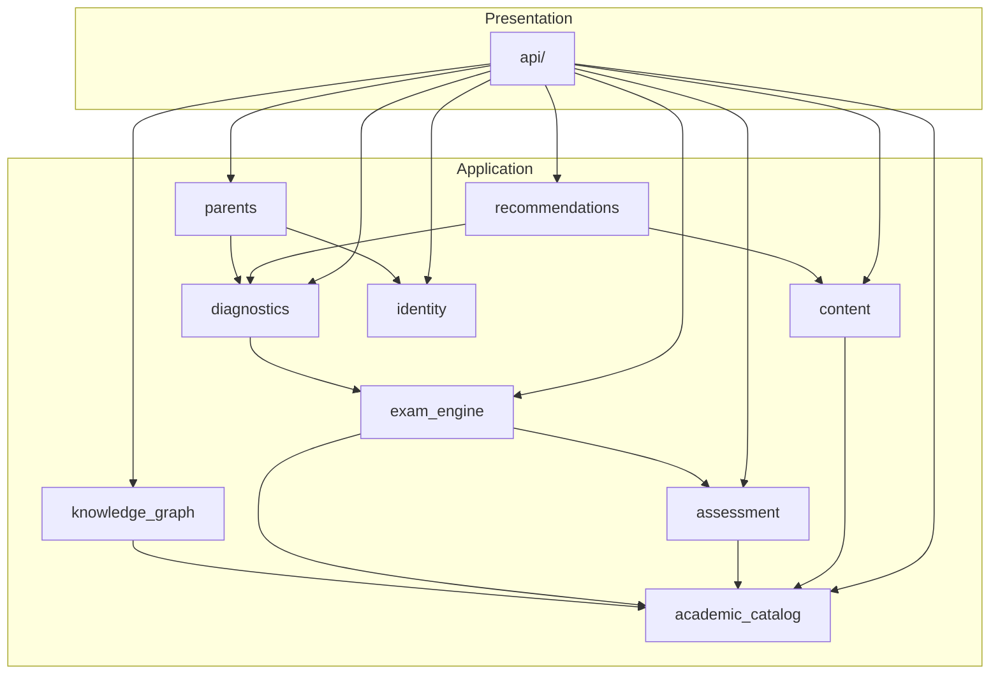

# Arquitectura — Pitágoras

Documento de referencia para la arquitectura del sistema. Describe componentes, capas, módulos y relaciones. No incluye bitácora de implementación (ver [IMPLEMENTATION_GUIDE.md](IMPLEMENTATION_GUIDE.md)).

---

## 1. Visión del sistema

Pitágoras es una plataforma de preparación para exámenes de admisión que modela el conocimiento académico como un **Knowledge Graph Académico Adaptativo (KGAA)**. La jerarquía principal vive en MySQL mediante claves foráneas; no requiere Neo4j en la primera versión.

### Analogía operativa

| Rol | Tecnología |
|-----|------------|
| Cliente | Flutter |
| Recepcionista | FastAPI |
| Jefe de cocina | LangGraph (orquestador) ✅ Etapa 8.1 |
| Cocineros especialistas (futuro) | Agentes (Tutor, Diagnóstico, Motivador, Padres) |
| Herramientas de cocina (futuro) | GPT + RAG (ChromaDB) |
| Despensa | MySQL |

FastAPI permanece como corazón del backend. LangGraph y los agentes viven **dentro** de FastAPI como módulos, no lo reemplazan.

---

## 2. Jerarquía académica (KGAA Nivel 1)

```
Universidad
└── Carrera
    └── Proceso de admisión
        └── Área (peso %)
            └── Componente
                └── Tema
                    └── Subtema
                        ├── Recursos (PDF, video, flashcards…)
                        └── Preguntas
```

### Ejemplo UNSA — Ingeniería

| Área | Peso |
|------|------|
| Matemática | 15 % |
| Ciencias Sociales | 30 % |
| Ciencia y Tecnología | 15 % |
| Desarrollo Personal, Ciudadanía y Cívica | 10 % |
| Comunicación | 25 % |
| Inglés | 5 % |

Agregar otra universidad (UNI, San Marcos, UNSAAC) implica **insertar registros**, no modificar código.

---

## 3. Niveles del Knowledge Graph

| Nivel | Contenido | Implementación v1 |
|-------|-----------|-------------------|
| 1 | Dominio académico (jerarquía) | MySQL + FKs |
| 2 | Recursos por subtema | Tabla `resources` |
| 3 | Banco de preguntas | Tabla `questions` → `subtopic_id` |
| 4 | Conceptos relacionados | Tabla `concept_relations` |
| 5 | Perfil del estudiante | `student_answers`, agregados |
| 6 | Diagnóstico | Snapshots post-examen |
| 7 | Plan de estudio | Recomendaciones por reglas |
| 8 | Agentes | Google ADK + LangGraph ✅ (Tutor, Diagnóstico, Motivador, Padres) |
| 9 | RAG | ChromaDB + embeddings ✅ |
| 10 | Relaciones del grafo | `prerequisito_de`, `relacionado_con`, `reforzado_por` |
| 11 | Grafo del estudiante | Historial, dominio, dificultad por subtema |

---

## 4. Clean Architecture

```
┌─────────────────────────────────────────────────────────────┐
│                    PRESENTATION (api/)                       │
│         Routers · Schemas Pydantic · Middleware              │
└────────────────────────────┬────────────────────────────────┘
                             │
┌────────────────────────────▼────────────────────────────────┐
│                   APPLICATION (use_cases/)                   │
│         Casos de uso · DTOs · Puertos (interfaces)           │
└────────────────────────────┬────────────────────────────────┘
                             │
┌────────────────────────────▼────────────────────────────────┐
│                      DOMAIN (domain/)                        │
│        Entidades · Value Objects · Reglas · Excepciones      │
└────────────────────────────▲────────────────────────────────┘
                             │
┌────────────────────────────┴────────────────────────────────┐
│                 INFRASTRUCTURE (infrastructure/)             │
│     SQLAlchemy · Repositorios · JWT · RAG/LLM                 │
└─────────────────────────────────────────────────────────────┘
```

**Regla de dependencia:** todas las flechas apuntan hacia el dominio. El dominio no importa FastAPI, SQLAlchemy ni Pydantic.

---

## 5. Módulos del backend

### Bounded contexts (dominio)

| Módulo | Responsabilidad |
|--------|-----------------|
| `identity` | Usuarios, estudiantes, padres, roles, vínculo padre–estudiante | ✅ Parcial (CU-01: `users` + `students.user_id`) |
| `academic_catalog` | Jerarquía universidad → subtema, pesos por área |
| `content` | Recursos educativos ligados a subtemas |
| `assessment` | Preguntas, opciones, metadatos (dificultad, tags, explicación) |
| `exam_engine` | Plantillas, sesiones, respuestas, calificación, tiempo |
| `diagnostics` | Perfil académico post-examen por nivel jerárquico |
| `recommendations` | Plan de estudio basado en reglas |
| `knowledge_graph` | Relaciones entre conceptos (`prerequisito_de`, etc.) |
| `parents` | Vista de progreso para padres |

### Módulos reservados (sin implementar en Etapa 1)

| Módulo | Tecnología | Cuándo |
|--------|------------|--------|
| `rag` | ChromaDB + embeddings | Etapa 6 |
| `llm` | OpenAI / Gemini | Etapa 7 |
| `agents` | Google ADK | Etapa 8 ✅ (solo Tutor) |
| `orchestrator` | LangGraph | Etapa 8.1 ✅ |

---

## 6. Estructura de carpetas

```
pitagoras/
├── docker/
│   ├── docker-compose.yml
│   ├── Dockerfile.api
│   └── mysql/
│
├── backend/
│   └── app/
│       ├── main.py
│       ├── core/                    # config, logging, excepciones, DI
│       ├── domain/                  # entidades y reglas por bounded context
│       ├── application/
│       │   ├── ports/               # interfaces de repositorios
│       │   └── use_cases/
│       ├── infrastructure/
│       │   ├── database/            # ORM, session, migraciones
│       │   ├── repositories/
│       │   ├── security/
│       │   ├── rag/                 # Etapa 6 ✅
│       │   ├── llm/                 # Etapa 7 ✅
│       │   ├── agents/              # Etapa 8 ✅ (Tutor ADK)
│       │   └── orchestrator/        # Etapa 8.1 ✅ (LangGraph)
│       └── api/
│           ├── v1/                  # routers REST
│           └── schemas/             # Pydantic
│
├── tests/
│   ├── unit/
│   └── integration/
│
└── docs/
    ├── ARCHITECTURE.md
    └── IMPLEMENTATION_GUIDE.md
```

---

## 7. Modelo de datos (referencia)

> Diseño relacional completo: **[DATABASE.md](DATABASE.md)** · DDL: `database/schema.sql`

### Jerarquía académica (implementada en Etapa 0.2)

```
universities
  └── careers
        └── admission_processes
              └── areas (weight_percent)
                    └── components
                          └── topics
                                └── subtopics
                                      └── questions → question_options
```

### Exámenes y resultados (implementado en Etapa 0.2)

```
exam_templates → exam_template_questions → questions
students → student_exams → student_answers
student_exams → exam_results
student_exams → exam_result_{areas, components, topics, subtopics}
```

### Implementado (Etapa 0.3–0.5)

```
backend/app/database/            # base.py + session.py
backend/app/auth/                 # CU-01: registro, login, JWT
backend/app/models/              # 19 modelos ORM (+ User)
backend/app/repositories/        # CRUD: University, Career, Area, Topic, Subtopic, Question
backend/app/schemas/             # Pydantic Create/Update/Response
backend/app/api/v1/              # REST: catálogo + motor de exámenes
backend/app/exams/               # ExamEngineService
backend/app/diagnostics/         # DiagnosticService (Etapa 4)
backend/app/recommendations/     # RecommendationService (Etapa 5)
backend/app/rag/                 # RAG: loader, chunking, embeddings, ChromaDB (Etapa 6)
backend/app/agents/              # ADK: tutor, diagnostic, motivator, parents + shared/
backend/app/orchestrator/         # LangGraph orquestador (Etapa 8.1+)
backend/app/llm/                 # LLMProvider OpenAI/Gemini
backend/app/prompts/             # Plantillas de prompts
backend/app/main.py              # FastAPI entrypoint
```

### Pendiente de diseño

```
resources (PDF, video, flashcards) → subtopics
concept_relations (prerequisito_de, relacionado_con)
parent_student_links + registro padres
study_recommendations (tabla dedicada, opcional)
```

---

## 8. Dependencias entre módulos



| Módulo | Depende de |
|--------|------------|
| `content` | `academic_catalog` |
| `assessment` | `academic_catalog` |
| `exam_engine` | `assessment`, `academic_catalog` |
| `diagnostics` | `exam_engine` |
| `recommendations` | `diagnostics`, `content` |
| `knowledge_graph` | `academic_catalog` |
| `parents` | `identity`, `diagnostics` |

Flujo unidireccional post-examen:

```
exam_engine → diagnostics → recommendations
```

---

## 9. Arquitectura de despliegue (objetivo)

```
┌────────────────────────────────────────────────────────────┐
│                     FLUTTER (APP)                          │
└───────────────────────────┬────────────────────────────────┘
                            │
                            ▼
┌────────────────────────────────────────────────────────────┐
│                    FASTAPI (BACKEND)                       │
│  Auth │ Exámenes │ Diagnóstico │ Recomendaciones │ IA   │
└───────────────┬────────────────────────────────────────────┘
                │
       ┌────────┴────────┐
       ▼                 ▼
    MySQL            ChromaDB
   (Etapa 1)         (Etapa 6+)
       │                 │
       └────────┬────────┘
                ▼
          LangGraph (Etapa 8+)
                │
    ┌───────────┼───────────┐
    ▼           ▼           ▼
 Tutor IA   Diagnóstico   Motivador
```

---

## 10. Flujo del Tutor IA (futuro — Etapa 7+)

Cuando el estudiante falla una pregunta, el sistema ya conoce el contexto completo:

```json
{
  "area": "Matemática",
  "componente": "Razonamiento Matemático",
  "tema": "Fracciones",
  "subtema": "Operaciones",
  "pregunta": 3501
}
```

```
Pregunta → Subtema → Knowledge Graph → Material relacionado
    → ChromaDB → Embeddings → LLM → Respuesta
```

El RAG filtra primero por el grafo; no busca entre miles de PDFs sin contexto.

---

## 11. Tecnologías y momento de adopción

| Tecnología | ¿Cuándo? | Función |
|------------|----------|---------|
| Flutter | Desde el inicio (cliente) | Interfaz del estudiante |
| FastAPI | Etapa 1 | API y lógica de negocio |
| MySQL + SQLAlchemy | Etapa 1 | Datos estructurados y KGAA |
| Docker | Etapa 1 | Entorno reproducible |
| ChromaDB | Etapa 6 | Índice vectorial para RAG |
| OpenAI / Gemini | Etapa 7 | Explicaciones y retroalimentación |
| Google ADK | Etapa 8 | Framework de agentes |
| LangGraph | Etapa 8.1 ✅ | Orquestación multi-agente (solo Tutor por ahora) |
| Agents CLI | Desarrollo | Scaffolding de agentes (no producción) |
| MCP | Opcional | Conexión estandarizada a herramientas externas |
| Neo4j | Futuro lejano | Solo si el volumen de relaciones lo justifica |

---

## 12. Decisiones arquitectónicas

1. **MySQL como fuente de verdad** — El KGAA vive en tablas relacionales; Neo4j solo si el volumen lo exige.
2. **ORM models ≠ domain entities** — El dominio no hereda de `Base` de SQLAlchemy.
3. **Diagnóstico como snapshot** — Se materializa al cerrar el examen; no se recalcula siempre desde cero.
4. **Ponderación en `areas`** — El motor de exámenes lee pesos del proceso de admisión.
5. **IA como adaptadores** — Puertos en application; implementación ADK+RAG en infrastructure.
6. **Desarrollo incremental** — Cada etapa entrega valor sin depender de la siguiente.

---

## 13. Referencias internas

- [README.md](../README.md) — Instalación y visión general
- [IMPLEMENTATION_GUIDE.md](IMPLEMENTATION_GUIDE.md) — Bitácora de desarrollo
